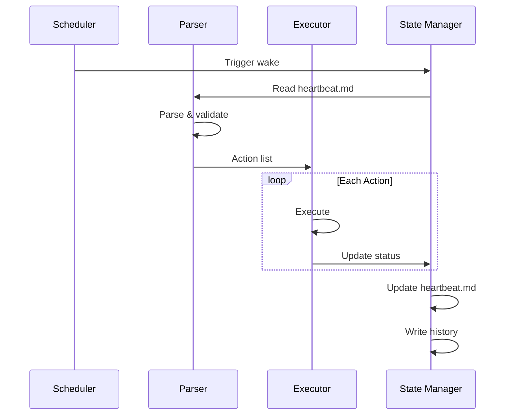

# System Architecture

## Overview

The Heartbeat Agent consists of four primary components that work together to create an autonomous execution loop.

```
┌────────────────────────────────────────────────────────────────┐
│                        HEARTBEAT AGENT                         │
├────────────────────────────────────────────────────────────────┤
│                                                                │
│  ┌──────────────┐    ┌──────────────┐    ┌──────────────┐     │
│  │   Scheduler  │───▶│    Parser    │───▶│   Executor   │     │
│  │              │    │              │    │              │     │
│  │ - cron       │    │ - read md    │    │ - run action │     │
│  │ - systemd    │    │ - validate   │    │ - handle err │     │
│  │ - openclaw   │    │ - prioritize │    │ - log result │     │
│  └──────────────┘    └──────────────┘    └──────────────┘     │
│          │                   │                   │             │
│          │                   ▼                   │             │
│          │           ┌──────────────┐            │             │
│          │           │    State     │            │             │
│          └──────────▶│   Manager    │◀───────────┘             │
│                      │              │                          │
│                      │ - heartbeat  │                          │
│                      │ - history    │                          │
│                      │ - config     │                          │
│                      └──────────────┘                          │
│                                                                │
└────────────────────────────────────────────────────────────────┘
```

## Component Details

### 1. Scheduler

Responsible for triggering the agent at appropriate intervals.

**Options:**
- **System cron** - Simple, reliable, widely available
- **Systemd timer** - Better logging, dependency management
- **OpenClaw cron** - Native integration, session management

```bash
# Example: System cron (every 5 minutes)
*/5 * * * * /path/to/heartbeat-agent wake

# Example: Systemd timer
[Timer]
OnCalendar=*:0/5
Persistent=true
```

See [[05-openclaw-integration#Cron Integration]] for OpenClaw-specific scheduling.

### 2. Parser

Reads and interprets the [[02-heartbeat-mechanism|heartbeat.md]] file.

**Responsibilities:**
- Parse markdown frontmatter (YAML)
- Extract action blocks
- Validate action syntax
- Sort by priority
- Filter by schedule/conditions

**Output:** Ordered list of executable actions

### 3. Executor

Runs actions and handles results.

**Responsibilities:**
- Execute actions in order
- Capture output/errors
- Handle timeouts
- Manage retries
- Log results

**Error Handling:**
```
Action fails → Check retry policy → Retry OR mark failed → Continue
```

See [[03-action-system#Execution Lifecycle]] for details.

### 4. State Manager

Maintains all persistent state.

**Files Managed:**

| File | Purpose |
|------|---------|
| `heartbeat.md` | Current actions and status |
| `history/` | Completed action logs |
| `config.yaml` | Agent configuration |
| `AGENTS.md` | Bootstrap context (OpenClaw) |

## Directory Structure

```
workspace/
├── heartbeat.md           # Primary action file
├── config.yaml            # Agent configuration
├── AGENTS.md              # Agent instructions (OpenClaw)
├── SOUL.md                # Persona definition (OpenClaw)
├── history/
│   ├── 2024-01-15.md      # Daily execution logs
│   └── 2024-01-16.md
├── actions/
│   ├── pending/           # Queued action files
│   └── templates/         # Action templates
└── logs/
    └── agent.log          # Runtime logs
```

## Data Flow



## Integration Points

### Input Sources
- Manual edits to heartbeat.md
- External systems writing to `actions/pending/`
- OpenClaw channel messages
- Webhook triggers

### Output Destinations
- File system changes
- External API calls
- OpenClaw channel replies
- Notification systems

## Next Steps

- [[02-heartbeat-mechanism]] - Define the heartbeat.md format
- [[03-action-system]] - Design the action system
- [[05-openclaw-integration]] - Plan OpenClaw integration
