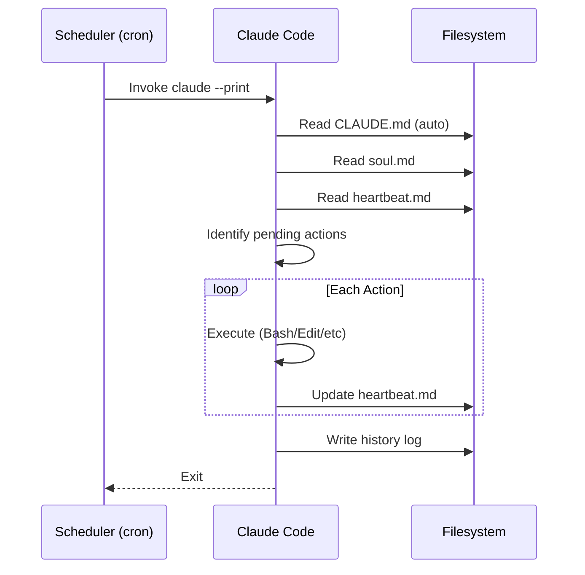

# System Architecture

## Overview

The Heartbeat Agent uses **Claude Code CLI** as its runtime engine. Instead of building custom parsers, executors, and state managers, we leverage Claude Code's native capabilities:

| Capability | Traditional Approach | Claude Code Approach |
|------------|---------------------|---------------------|
| Parse heartbeat.md | Custom markdown parser | Claude reads and understands natively |
| Execute shell commands | Custom executor + subprocess | Claude's Bash tool |
| Make HTTP requests | Custom HTTP client | Claude runs `curl` via Bash |
| Update state files | Custom file manager | Claude's Edit/Write tools |
| Handle errors | Custom retry logic | Claude's reasoning + instructions |
| Log results | Custom logging system | Claude updates history files |

**Result**: Zero custom code required. Just configuration files.

## Architecture Diagram

```
┌────────────────────────────────────────────────────────────────┐
│                      HEARTBEAT SYSTEM                          │
├────────────────────────────────────────────────────────────────┤
│                                                                │
│  ┌──────────────┐                                              │
│  │   Scheduler  │  (cron, systemd, or launchd)                │
│  │              │                                              │
│  │  */5 * * *   │──────────────┐                              │
│  └──────────────┘              │                              │
│                                ▼                              │
│                    ┌───────────────────┐                      │
│                    │   Claude Code     │                      │
│                    │       CLI         │                      │
│                    │                   │                      │
│                    │  claude --prompt  │                      │
│                    │  "Read heartbeat  │                      │
│                    │   and execute"    │                      │
│                    └─────────┬─────────┘                      │
│                              │                                │
│            ┌─────────────────┼─────────────────┐              │
│            │                 │                 │              │
│            ▼                 ▼                 ▼              │
│    ┌───────────┐     ┌───────────┐     ┌───────────┐         │
│    │  Read     │     │  Bash     │     │  Edit     │         │
│    │  Tool     │     │  Tool     │     │  Tool     │         │
│    │           │     │           │     │           │         │
│    │ soul.md   │     │ commands  │     │ update    │         │
│    │heartbeat  │     │ curl/http │     │ status    │         │
│    └───────────┘     └───────────┘     └───────────┘         │
│                                                                │
└────────────────────────────────────────────────────────────────┘
```

## Component Details

### 1. Scheduler

Triggers Claude Code at regular intervals. Choose one:

**Option A: Cron (Recommended)**
```bash
# Edit crontab: crontab -e
*/5 * * * * cd /path/to/workspace && claude --print "Read heartbeat.md and execute pending actions" >> /var/log/heartbeat.log 2>&1
```

**Option B: Systemd Timer**
```ini
# /etc/systemd/system/heartbeat.timer
[Unit]
Description=Heartbeat Agent Timer

[Timer]
OnCalendar=*:0/5
Persistent=true

[Install]
WantedBy=timers.target
```

```ini
# /etc/systemd/system/heartbeat.service
[Unit]
Description=Heartbeat Agent

[Service]
Type=oneshot
WorkingDirectory=/path/to/workspace
ExecStart=/usr/local/bin/claude --print "Read heartbeat.md and execute pending actions"
```

**Option C: macOS launchd**
```xml
<!-- ~/Library/LaunchAgents/com.heartbeat.agent.plist -->
<?xml version="1.0" encoding="UTF-8"?>
<!DOCTYPE plist PUBLIC "-//Apple//DTD PLIST 1.0//EN" "http://www.apple.com/DTDs/PropertyList-1.0.dtd">
<plist version="1.0">
<dict>
    <key>Label</key>
    <string>com.heartbeat.agent</string>
    <key>ProgramArguments</key>
    <array>
        <string>/usr/local/bin/claude</string>
        <string>--print</string>
        <string>Read heartbeat.md and execute pending actions</string>
    </array>
    <key>WorkingDirectory</key>
    <string>/path/to/workspace</string>
    <key>StartInterval</key>
    <integer>300</integer>
</dict>
</plist>
```

### 2. Claude Code CLI

The agent runtime. Claude Code provides:

- **Read tool** - Read any file (heartbeat.md, soul.md, configs)
- **Bash tool** - Execute shell commands, run curl, interact with APIs
- **Edit/Write tools** - Update heartbeat.md, write logs
- **Reasoning** - Understand action priorities, handle errors intelligently

### 3. Bootstrap Files

These files tell Claude Code how to behave:

| File | Purpose |
|------|---------|
| `soul.md` | Agent persona, behavior rules, constraints |
| `heartbeat.md` | Current actions and execution state |
| `CLAUDE.md` | Claude Code-specific instructions (optional) |

## Claude Code Invocation

### Basic Invocation

```bash
# One-shot execution (for cron)
claude --print "Read heartbeat.md and execute all pending actions. Update status when done."

# With system prompt file
claude --system-prompt soul.md --print "Process heartbeat"

# Headless/non-interactive mode
claude --print --no-spinner "Execute heartbeat actions"
```

### Using CLAUDE.md

Create a `CLAUDE.md` file in your workspace root. Claude Code automatically reads this on startup:

```markdown
# CLAUDE.md

You are a Heartbeat Agent. On each invocation:

1. Read `soul.md` for your persona and rules
2. Read `heartbeat.md` for pending actions
3. Execute each PENDING action in priority order (CRITICAL > HIGH > MEDIUM > LOW)
4. Update the action's status in heartbeat.md after execution
5. Log results to `history/YYYY-MM-DD.md`

## Execution Rules

- For shell actions: Use the Bash tool
- For HTTP actions: Use `curl` via Bash
- For file actions: Use Read/Edit/Write tools
- Always update status to COMPLETED or FAILED
- Continue with remaining actions if one fails (unless CRITICAL)
```

### Recommended Invocation

```bash
# The simplest approach - CLAUDE.md handles everything
cd /path/to/workspace && claude --print "Wake up and process heartbeat"
```

## Directory Structure

```
workspace/
├── CLAUDE.md              # Claude Code instructions (auto-loaded)
├── soul.md                # Agent persona and rules
├── heartbeat.md           # Current actions and state
├── history/
│   ├── 2024-01-15.md      # Daily execution logs
│   └── 2024-01-16.md
└── config/                # Optional configuration
    └── secrets.env        # Environment variables (never commit!)
```

## Data Flow



## Why Claude Code?

### Advantages

1. **Zero Code** - No parser, executor, or state manager to build
2. **Intelligent Execution** - Claude understands context, handles edge cases
3. **Native File Operations** - Read/Edit/Write tools work out of the box
4. **Shell Integration** - Full Bash access for any command
5. **Error Handling** - Claude can reason about and recover from errors
6. **Human-Readable Logs** - Natural language execution summaries

### Considerations

1. **API Costs** - Each invocation uses Claude API tokens
2. **Latency** - ~5-30 seconds per invocation depending on complexity
3. **Network Required** - Needs internet for API calls
4. **Rate Limits** - Consider API rate limits for frequent schedules

### Cost Optimization

- Use `--model haiku` for simple, routine tasks
- Batch multiple actions per invocation
- Use longer intervals (15m instead of 5m) when possible
- Keep heartbeat.md concise

## Security Considerations

1. **Workspace Isolation** - Run in dedicated directory
2. **No Secrets in Files** - Use environment variables
3. **Command Restrictions** - Document allowed/blocked commands in soul.md
4. **API Key Protection** - Never commit `.env` or API keys

## Next Steps

- [[02-heartbeat-mechanism]] - Define the heartbeat.md format
- [[03-action-system]] - Action types Claude Code can execute
- [[06-configuration]] - Configuration options
