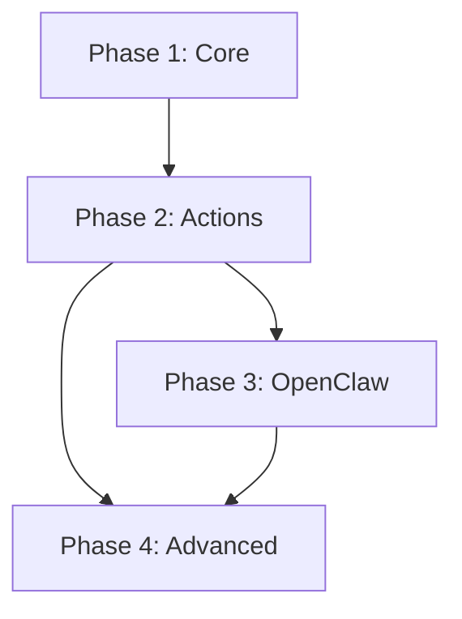

# Implementation Phases

## Overview

The implementation is divided into four phases, each building on the previous. Each phase delivers working functionality.

```
Phase 1        Phase 2        Phase 3        Phase 4
┌──────┐      ┌──────┐      ┌──────┐      ┌──────┐
│ Core │ ───▶ │Basic │ ───▶ │OpenCl│ ───▶ │Advanc│
│Heart │      │Action│      │aw    │      │ed    │
│beat  │      │Exec  │      │Integ │      │      │
└──────┘      └──────┘      └──────┘      └──────┘
   │             │             │             │
   ▼             ▼             ▼             ▼
 Parse        Execute       Channel      AI Actions
 Update       Shell/HTTP    Notify       Workflows
 Schedule     Retry         Sessions     Dashboard
```

---

## Phase 1: Core Heartbeat Mechanism

**Goal:** Basic heartbeat file parsing and state management.

### Deliverables

1. **Heartbeat Parser**
   - Parse markdown frontmatter
   - Extract action blocks
   - Validate syntax
   - Handle malformed input gracefully

2. **State Manager**
   - Read/write heartbeat.md
   - File locking
   - Atomic updates
   - Backup before modification

3. **Scheduler Integration**
   - Cron job setup
   - Systemd timer option
   - Manual trigger command

4. **CLI Interface**
   ```bash
   heartbeat init          # Create initial heartbeat.md
   heartbeat wake          # Trigger agent wake cycle
   heartbeat status        # Show current state
   heartbeat validate      # Validate heartbeat.md syntax
   ```

### Technical Tasks

- [ ] Define TypeScript/Python types for heartbeat schema
- [ ] Implement markdown parser with YAML frontmatter support
- [ ] Build action block extractor
- [ ] Create file manager with locking
- [ ] Write atomic update function
- [ ] Build CLI framework
- [ ] Add logging infrastructure
- [ ] Write unit tests for parser
- [ ] Create example heartbeat.md files

### Acceptance Criteria

- [ ] Can parse valid heartbeat.md files
- [ ] Gracefully handles invalid files with clear errors
- [ ] Updates don't corrupt file on failure
- [ ] CLI commands work as documented
- [ ] 80%+ test coverage on parser

### Files to Create

```
src/
├── parser/
│   ├── heartbeat-parser.ts
│   ├── action-parser.ts
│   └── frontmatter.ts
├── state/
│   ├── state-manager.ts
│   └── file-lock.ts
├── cli/
│   ├── index.ts
│   └── commands/
│       ├── init.ts
│       ├── wake.ts
│       ├── status.ts
│       └── validate.ts
└── types/
    └── index.ts
```

---

## Phase 2: Basic Action Execution

**Goal:** Execute shell and HTTP actions with retry support.

### Deliverables

1. **Action Executor Framework**
   - Plugin architecture for action types
   - Timeout handling
   - Output capture
   - Error normalization

2. **Shell Action Handler**
   - Command execution
   - Working directory support
   - Environment variables
   - Output capture

3. **HTTP Action Handler**
   - Request building
   - Response validation
   - Status code checking
   - Timeout handling

4. **Retry System**
   - Configurable retry policies
   - Backoff strategies
   - Retry state tracking

5. **Execution History**
   - Log completed actions
   - Track execution times
   - Store error details
   - Daily log rotation

### Technical Tasks

- [ ] Design executor plugin interface
- [ ] Implement base executor class
- [ ] Build shell action handler
- [ ] Build HTTP action handler
- [ ] Create retry policy system
- [ ] Implement backoff calculators
- [ ] Build history logger
- [ ] Add execution metrics
- [ ] Write integration tests
- [ ] Create action examples

### Acceptance Criteria

- [ ] Shell commands execute correctly
- [ ] HTTP requests work with auth headers
- [ ] Timeouts trigger correctly
- [ ] Retries follow configured policy
- [ ] Failed actions logged with details
- [ ] History files created daily

### Files to Create

```
src/
├── executor/
│   ├── executor.ts
│   ├── action-handler.ts
│   └── handlers/
│       ├── shell.ts
│       ├── http.ts
│       └── file.ts
├── retry/
│   ├── retry-policy.ts
│   └── backoff.ts
└── history/
    └── history-logger.ts
```

---

## Phase 3: OpenClaw Integration

**Goal:** Integrate with OpenClaw for messaging and scheduling.

### Deliverables

1. **OpenClaw Cron Integration**
   - Register as OpenClaw cron job
   - Use `next-heartbeat` wake mode
   - Session isolation

2. **Channel Notifications**
   - Send results to configured channels
   - Support Slack, Discord, Telegram
   - Format messages appropriately

3. **Bootstrap Files**
   - AGENTS.md integration
   - SOUL.md for persona
   - Session context

4. **Message Queue Integration**
   - Receive actions via messages
   - Queue for next heartbeat
   - Reply with results

### Technical Tasks

- [ ] Research OpenClaw cron API
- [ ] Implement cron job registration
- [ ] Build notification action handler
- [ ] Create channel formatters
- [ ] Integrate AGENTS.md reading
- [ ] Add message queue listener
- [ ] Build reply formatter
- [ ] Test with OpenClaw gateway
- [ ] Document setup process

### Acceptance Criteria

- [ ] Agent wakes via OpenClaw cron
- [ ] Notifications sent to channels
- [ ] Messages can add actions
- [ ] Bootstrap files respected
- [ ] Works with existing OpenClaw setup

### Files to Create

```
src/
├── openclaw/
│   ├── cron-integration.ts
│   ├── channel-notifier.ts
│   ├── message-handler.ts
│   └── bootstrap.ts
├── executor/handlers/
│   └── notify.ts
└── config/
    └── openclaw-config.ts
```

### Configuration

```yaml
# config.yaml
openclaw:
  enabled: true
  gateway: ws://127.0.0.1:18789
  cron:
    schedule: "*/5 * * * *"
    session: main
  notify:
    default_channel: telegram
    on_failure: slack:#alerts
```

---

## Phase 4: Advanced Features

**Goal:** AI-powered actions, workflows, and monitoring.

### Deliverables

1. **Agent Action Handler**
   - Delegate tasks to AI
   - Context file injection
   - Tool restrictions
   - Output parsing

2. **Composite Actions**
   - Action grouping
   - Sequential/parallel execution
   - Failure handling modes

3. **Workflow Engine**
   - Multi-step workflows
   - Branching logic
   - State persistence

4. **Web Dashboard**
   - View current state
   - Execution history
   - Manual triggers
   - Configuration editor

5. **Advanced Scheduling**
   - File change triggers
   - Webhook triggers
   - Event-driven actions

### Technical Tasks

- [ ] Build agent action handler
- [ ] Implement composite executor
- [ ] Design workflow schema
- [ ] Build workflow engine
- [ ] Create dashboard backend
- [ ] Build dashboard frontend
- [ ] Add file watcher
- [ ] Implement webhook receiver
- [ ] Add metrics endpoint
- [ ] Write e2e tests

### Acceptance Criteria

- [ ] AI actions complete tasks correctly
- [ ] Composites handle failures properly
- [ ] Workflows persist state
- [ ] Dashboard shows real-time status
- [ ] Webhooks trigger actions

### Files to Create

```
src/
├── executor/handlers/
│   ├── agent.ts
│   └── composite.ts
├── workflow/
│   ├── workflow-engine.ts
│   ├── workflow-parser.ts
│   └── workflow-state.ts
├── triggers/
│   ├── file-watcher.ts
│   └── webhook.ts
└── dashboard/
    ├── server.ts
    └── api/
        ├── status.ts
        ├── history.ts
        └── trigger.ts
```

---

## Timeline Summary

| Phase | Focus | Key Deliverable |
|-------|-------|-----------------|
| 1 | Core | Heartbeat parser + CLI |
| 2 | Actions | Shell + HTTP execution |
| 3 | Integration | OpenClaw channels |
| 4 | Advanced | AI actions + dashboard |

## Dependencies



## Next Steps

Start with [[#Phase 1 Core Heartbeat Mechanism|Phase 1]] tasks.
